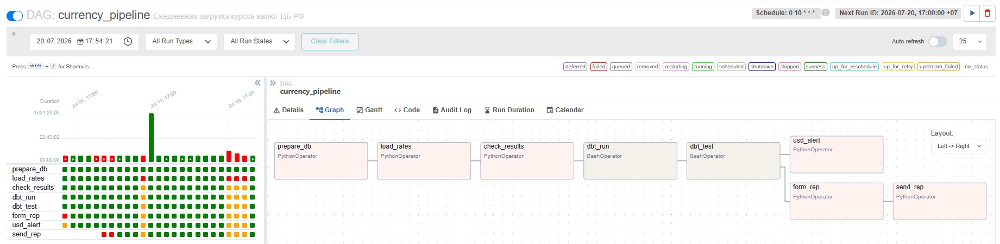
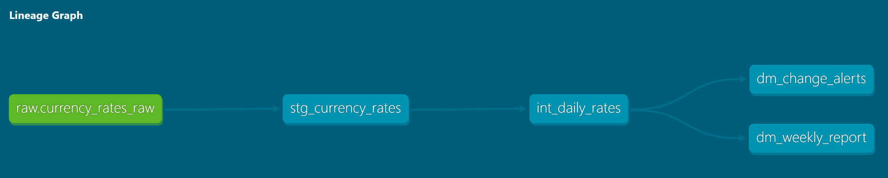
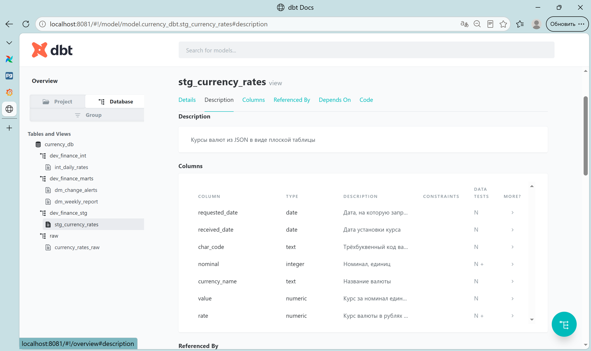
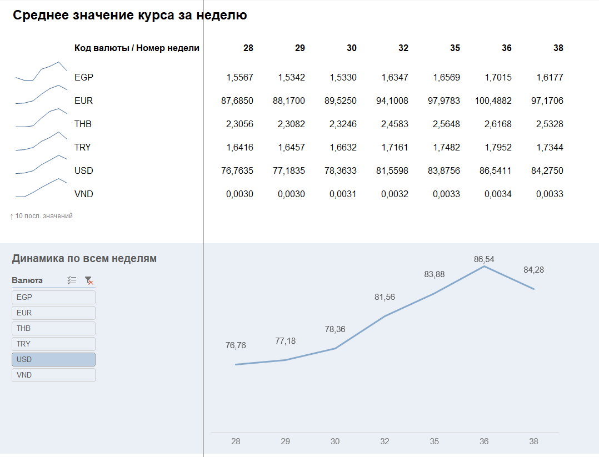
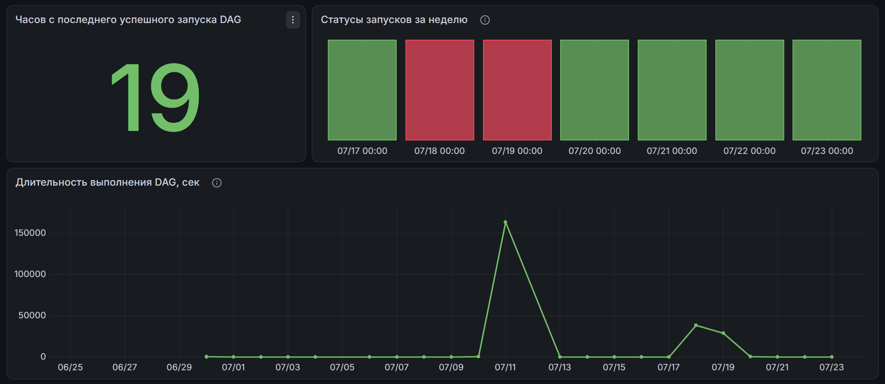
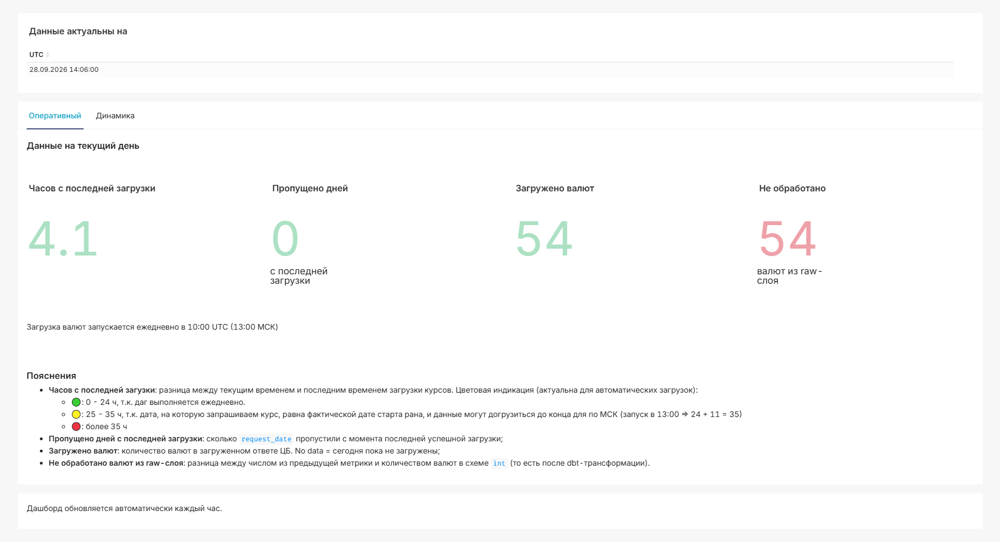
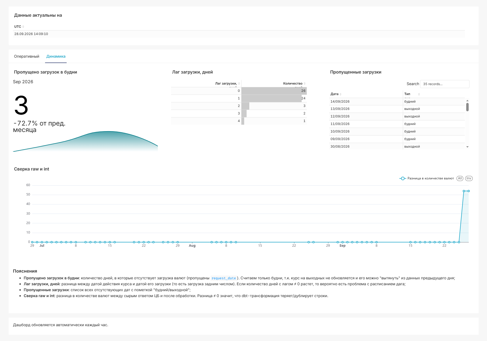
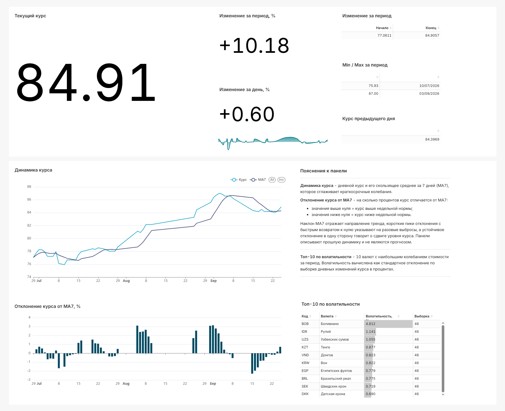

## ELT-пайплайн для курсов валют ЦБ РФ

Сбор, трансформация и визуализация данных о курсах валют ЦБ РФ. Проект автоматизирует процесс получения данных через API, загрузку сырых данных в базу, трансформацию через dbt и визуализацию в Grafana и Superset, а также формирование отчета Excel и алерта c отправкой по email.

### Цель

Собрать в одном проекте инструменты из предыдущих + добавить новые (`uv`, `dbt`, `grafana`). Посмотреть на их работу в связке друг с другом.

**Что нового было освоено в рамках проекта**

* **uv** как замена pip и venv
* **ruff** для форматирования python кода
* **pytest** для тестирования python кода
* **dockerfile** для создания образа Airflow с dbt
* **dbt** для трансформации данных в хранилище
* **grafana** и **superset** для визуализации полученных данных

### Как это работает (общая схема)

```text
API ЦБ РФ
↓
Airflow DAG
↓
PostgreSQL raw слой (тут сырой ответ в JSONB)
↓
dbt: staging → intermediate → marts
↓
дашборды в графане и superset / отчет и алерт на почту
```

**Стек:** python 3.11+ (uv, ruff), airflow, dbt, postgres (jsonb), sqlite (для разработки без docker), grafana, superset 5.0

### Структура проекта

```text
currency-rate-project/
├─ src/elt/
│   ├── api_client.py            # запросы курсов с ретраями
│   ├── xml_converter.py         # xml в json
│   ├── loader.py                # upsert в БД
│   ├── config.py                # константы
│   └── run.py                   # ручной запуск для отладки
├─ tests/
│   ├── test_api_client.py
│   └── test_loader.py
├─ airflow/
│   ├── dags/
│   │  └── currency_pipeline.py
│   └── reports/                 # еженедельные excel отчеты
│      └── svod_auto_report.xlsx # PQ-шаблон для сборки сводного отчета
├─ currency_dbt/
│   ├── dbt_project.yml
│   ├── packages.yml             # dbt-utils макросы
│   ├── profiles.yml
│   └── models/
│      ├── staging/
│      ├── intermediate/
│      └── marts/ 
├─ sql/
│   ├── init_airflow_db.sql
│   ├── init_airflow_reader.sql
│   ├── init_grafana_user.sql
│   └── init_bi.sql
├─ grafana/provisioning/
│   ├── alerting/
│   │  ├── contact_points.yaml
│   │  ├── policies.yaml
│   │  └── alert_rules.yaml
│   ├── dashboards/
│   │  ├── dashboards.yml
│   │  └── json/                 # json дашбордов
│   │     ├── business/          # бизнес-дашборды
│   │     │  ├── currency_dash.json
│   │     │  ├── usd_dash.json
│   │     │  └── thb_dash.json
│   │     └── tech/              # технический дашборд
│   │        └── etl_monitoring.json
│   └── datasources/
│      └── postgres.yaml
├─ superset/
│   ├── assets/
│   │  ├── charts/
│   │  ├── dashboards/
│   │  ├── datasets/
│   │  ├── databases/
│   │  └── metadata.yaml
│   ├── bootstrap.sh          # скрипт инициализации
│   └── superset_config.py    # конфигурация superset
├─ screenshots/
├─ Dockerfile                 # airflow:2.9.3 + dbt-postgres
├─ Dockerfile.superset        # superset 5.0 + psycopg2-binary
├─ docker-compose.yml         # postgres, airflow, pgadmin, grafana, superset
├─ pyproject.toml             # зависимости (uv)
├─ .env.example
└─ README.md
```
##### Схема DAG и статусы тасков



##### Граф зависимостей dbt

<div align="center">
  
</div>

<details>
  <summary>Скриншот c документацией dbt (staging-слой)</summary>
  <br>
  
</details>

---
### Запуск

```bash
# 1. Клонируем
git clone https://github.com/ваш-логин/currency-rate-project.git
cd currency-rate-project

# 2. Настраиваем .env (нужно отредактировать)
cp .env.example .env

# 3. Устанавливаем зависимости
uv sync

# 4. Собираем образ airflow с dbt (перед первым запуском)
docker build -t my-airflow-with-dbt .

# 5. Запускаем контейнеры
# базовый сценарий без BI
docker-compose up -d
# базовые сервисы + BI (bi-init и superset)
docker-compose --profile bi up -d
```
После запуска:

| Сервис	| URL	| Логин / Пароль |
|-|-|-|
|Airflow	|http://localhost:8080	|admin / admin|
|Grafana	|http://localhost:3000	|admin / admin|
|pgAdmin	|http://localhost:5050	|admin@example.com / admin|
|Superset	|http://localhost:8088	|admin / admin|

В Airflow включаем DAG currency_pipeline. Он настроен на ежедневное выполнение в 10:00 UTC.

##### Перезалив курсов за конкретный день

DAG берет дату из дня запуска рана и пропущенные дни не догоняет (`catchup=False`): если контейнеры не были подняты в 10:00 UTC, день теряется. Дозалить его можно ручным запуском, в поле `target_date` указать дату в формате `ГГГГ-ММ-ДД`. Повторная загрузка за уже существующую дату  дубликатов не создает.

##### Запуск dbt с локальной машины

Логин, пароль и имя БД в `profiles.yml` берутся из переменных окружения, поэтому нужно подгрузить `.env`:

```bash
uv run --env-file .env dbt run --project-dir currency_dbt --profiles-dir currency_dbt
```

Таргет по умолчанию - `dev`, он ходит в тот же контейнер с Postgres через `localhost:5432`, но пишет в схему `dev_finance` (а не `finance`). Контейнеры при этом должны быть подняты.

---
### Отчетность

####  Excel

1. Еженедельный отчет
- Путь: `./airflow/reports/`
- Имя файла: `weekly_report_YYYY-MM-DD[_manual].xlsx`
- Режимы запуска:
  - *Автоматический* (по расписанию): формируется по понедельникам, данные за прошедшую неделю пн-вс, отправляется на почту (если настроен SMTP в airflow)
  - *Ручной*: формируется в любой день недели, в имя файла добавляется суффикс `_manual`, не отправляется на почту

2. Сводный отчет (через Power Query)
Содержит таблицу со списком валют и средним значением курса в разрезе номеров недель.

- Путь: `./airflow/reports/`
- Имя файла: `svod_auto_report.xlsx`
- Источник данных: автоматически сформированные еженедельные отчеты

<details>
  <summary>Скриншот отчета</summary>
  <br>
  
</details>

####  Алерт по USD на почту (Airflow)

- Проверяет изменение >2% за сутки
- Пишет в лог и отправляет уведомление на почту (если настроен SMTP в airflow). Уведомление содержит:
  - Заголовок с направлением изменения (повышение или снижение)
  - Предыдущее и текущее значение курса
  - Изменение в процентах

<details>
  <summary>Настройка SMTP через Connection:</summary>
  
  |Параметр|Значение|
  |---|---|
  |Conn Id|smtp_default|
  |Conn Type|smtp|
  |Host|smtp.yandex.ru (или другой)|
  |Port|465|
  |Login|адрес почты (например your_login@yandex.ru)|
  |Password|пароль приложения (не от почты)|
  |Disable TLS|проставить галочку|

</details>

####  Мониторинг состояния ETL (Grafana)

Для контроля состояния пайплайна добавлен **дашборд ETL Healthcheck**. Источник данных: метабаза Airflow

<div align="center">
  
</div>

Также настроен **алерт**, который срабатывает, если последний успешный запуск дага `currency_pipeline` был более 24 часов назад, с уведомлением на email (замените адрес почты recipient_login@example.com в `grafana/provisioning/alerting/contact_points.yaml` на нужный).

####  Мониторинг качества данных (Superset[^*])

Дашборд для анализа качества загружаемых данных. Источник данных: БД с курсами валют.

<table>
  <tr>
    <td min-width="500px">
      
    </td>
    <td min-width="500px">
      
    </td>
  </tr>
  <tr>
    <td align="center">Показатели для ежедневной проверки состояния данных в базе</td>
    <td align="center">Тут можно проследить за стабильностью этого состояния</td>
  </tr>
</table>

Этот дашборд смотрит на *сами данные*, тогда как [Мониторинг состояния ETL](#мониторинг-состояния-etl-grafana) смотрит на метабазу airflow (статусы `dag_run`): dag может отработать успешно, но при этом залить неполные данные.

####  Данные по валюте за период (Superset[^*])

Параметризованный дашборд для анализа динамики курсов валют к рублю за выбранный период. 

Фильтры: валюта и период (по умолчанию: USD и последние 90 дней).

Источник данных: `currency_db.finance_int.int_daily_rates`.

<div align="center">
  
</div>

[^*]: чтобы импортировать дашборд Superset, нужно заменить `XXXXXX` в строке подключения к БД `sqlalchemy_uri` на пароль для роли `bireader` в `superset/assets/databases/PostgreSQL.yaml`.

---
###  Тесты

test_api_client.py - проверка URL и формата даты

test_loader.py - проверка upsert-логики

```bash
uv run pytest tests/ -v
```

---
###  Что можно улучшить

* <ins>инкрементальные модели dbt</ins>
  
  сейчас тип материализации `table`, т.к. данных мало (~20 тыс строк в год), при росте может иметь смысл перевести на `incremental` чтобы не пересобирать таблицы каждый день

* ~~добавить дашборд в графане для мониторинга elt на основе данных метабазы эйрфлоу~~

* <ins>вынести пароли графаны из `sql/init_*.sql`</ins>
  
  требует перевода init-скриптов в `.sh`, т.к. в `.sql` переменные окружения не подставляются

* <ins>добавить ISO-год к `week_num` в сводном отчете</ins>
  
  номера недель повторяются каждый год, поэтому при накоплении отчетов данные за недели разных годов будут суммироваться. Нужен именно `EXTRACT(ISOYEAR)`, то есть год, определяемый по системе нумерации недель, а не календарный, т.к. неделя на стыке годов может разделиться надвое

* <ins>добавить makefile</ins>

* <ins>добавить больше тестов</ins>

  например dbt-тесты на бизнес правила и `dbt source freshness` (в raw-слое уже есть уже есть `loaded_at`)

* <ins>автоматическая дозагрузка пропущенных дней</ins>

  добавить таск, который смотрит, каких дат за последние n дней не хватает в raw-слое, и дозагружает их

* <ins>учесть логику публикации курсов</ins> (подумать, нужно ли)

  в сб и вс ЦБ курсы не устанавливает, то есть курсы, опубликованные в пт, будут действовать в сб, вс и пн, а пн будут опубликованы уже новые курсы, которые будут действовать во вт. Таким образом, среднее за 7 дней `avg_rate_7d` учитывает субботний курс трижды; на дашборде с тепловой картой нули в пн и вс, хотя интуитивно ожидаешь в сб и вс

* <ins>добавить возможность исторической дозагрузки</ins>

  имеется в виду реализация через другой запрос к api ЦБ с диапазоном дат или, в крайнем случае, прогон текущего скрипта в цикле

Часть приведенных пунктов - итог [ревью кода с Claude Code, PR #2](https://github.com/kashlach/DE-basics-learning/pull/2), а точнее то, что в ходе ревью было отложено.